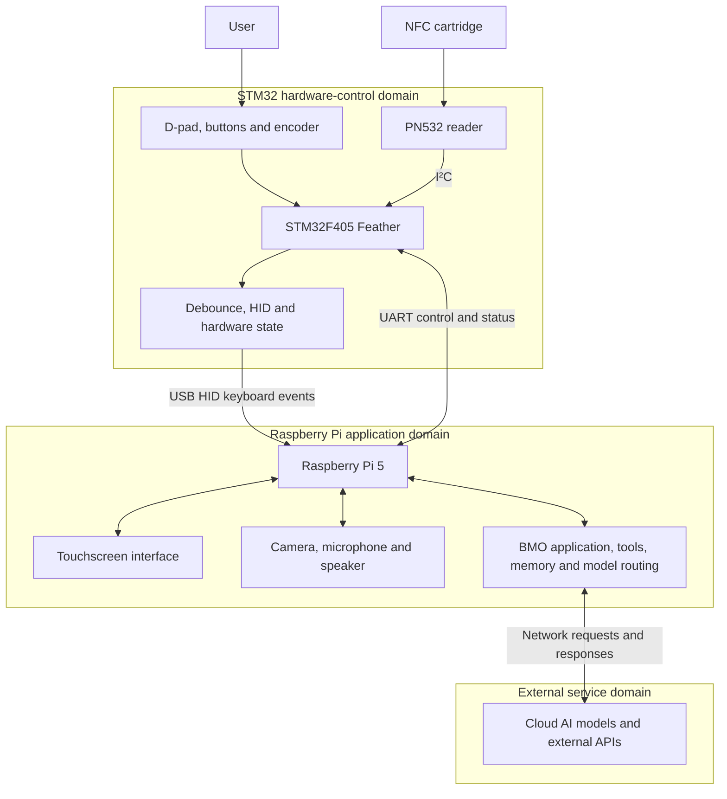

**This file gives a basic understanding of the main vertical slice of this project**

## Chart

## Basic ownership boundaries:

| Boundary                        | Owns                                                                                                                                                                             | Does not own                                                                         |
| ------------------------------- | -------------------------------------------------------------------------------------------------------------------------------------------------------------------------------- | ------------------------------------------------------------------------------------ |
| STM32 hardware controller       | D-pad and button scanning, rotary encoder, debouncing, USB HID reports, PN532 communication, raw cartridge UID detection, physical hardware state, hardware errors               | Personality selection, UI, speech, camera processing, AI decisions, network services |
| Raspberry Pi application system | Linux, touchscreen UI, camera, microphone, speaker, application state, mapping cartridge UIDs to modes, speech, vision, tools, memory, local models, cloud-service orchestration | Raw switch timing, mechanical debouncing, directly operating the PN532               |
| External services               | Cloud LLM inference and external APIs such as weather or calendar services                                                                                                       | Device state, physical hardware, UI state, permanent ownership of BMO’s behavior     |

## Communication examples for clarity:

**USB HID (standard inputs)**

The STM32 sends keyboard events to the Pi through USB:
- D-pad → arrow keys
- Large red button → Enter
- Green button → Escape
- Blue/triangle button → F13
- Rotary encoder → media controls

**UART: separate bidirectional control and status channel**

Possible STM32-to-Pi messages:
- Cartridge detected, including raw UID
- Cartridge removed
- Hardware ready
- Hardware fault
- Current input state

Possible Pi-to-STM32 messages:
- Change an LED
- Enter a hardware mode
- Request hardware status
- Acknowledge an event
- Reset a peripheral