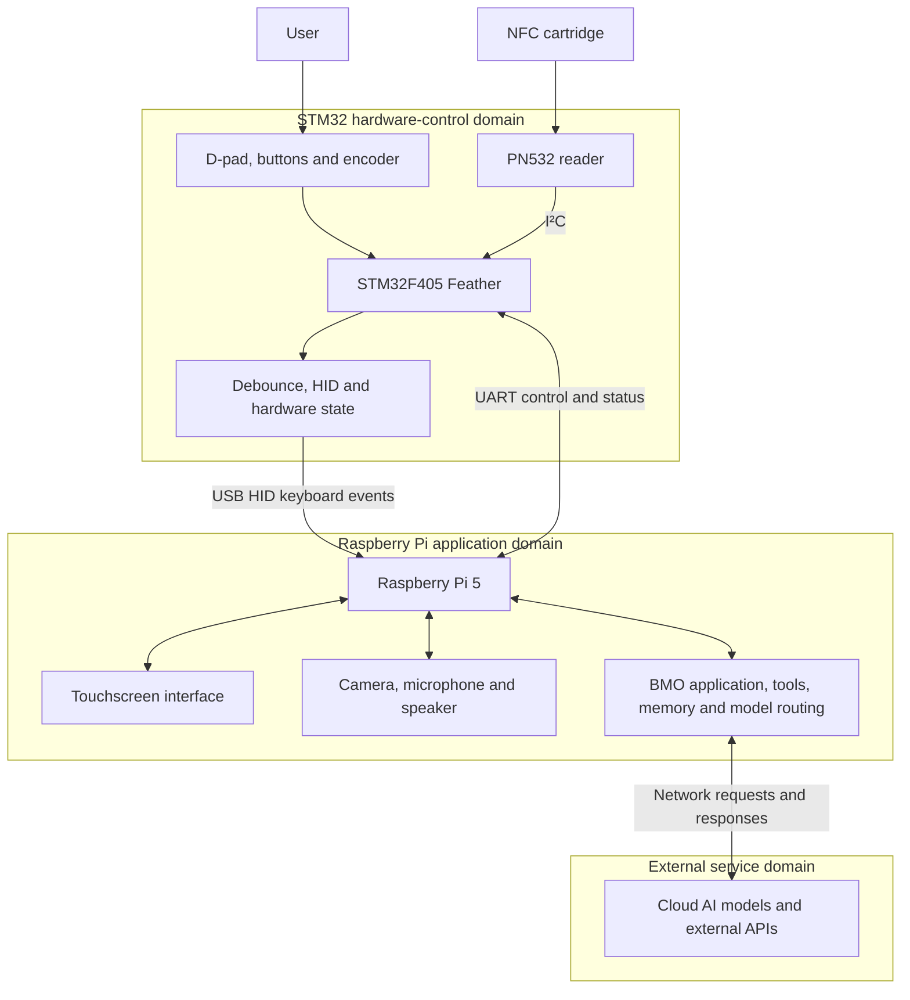

**This file gives a basic understanding of the main vertical slice of this project**

## Chart

## Basic ownership boundaries:

| Boundary                        | Owns                                                                                                                                                                             | Does not own                                                                         |
| ------------------------------- | -------------------------------------------------------------------------------------------------------------------------------------------------------------------------------- | ------------------------------------------------------------------------------------ |
| STM32 hardware controller       | D-pad and button scanning, rotary encoder, debouncing, USB HID reports, PN532 communication, raw cartridge UID detection, physical hardware state, hardware errors               | Personality selection, UI, speech, camera processing, AI decisions, network services |
| Raspberry Pi application system | Linux, touchscreen UI, camera, microphone, speaker, application state, mapping cartridge UIDs to modes, speech, vision, tools, memory, local models, cloud-service orchestration | Raw switch timing, mechanical debouncing, directly operating the PN532               |
| External services               | Cloud LLM inference and external APIs such as weather or calendar services                                                                                                       | Device state, physical hardware, UI state, permanent ownership of BMO’s behavior     |

## Communication examples for clarity:

**USB HID (standard inputs)**

The STM32 sends keyboard events to the Pi through USB:
- D-pad → arrow keys
- Large red button → Enter
- Green button → Escape
- Blue/triangle button → F13
- Rotary encoder → media controls

**UART: separate bidirectional control and status channel**

Possible STM32-to-Pi messages:
- Cartridge detected, including raw UID
- Cartridge removed
- Hardware ready
- Hardware fault
- Current input state

Possible Pi-to-STM32 messages:
- Change an LED
- Enter a hardware mode
- Request hardware status
- Acknowledge an event
- Reset a peripheral

STM32F405 Feather connection table (For now)

| Device/function       | Feather connection                         | Other end                       | Purpose                                                        |
| --------------------- | ------------------------------------------ | ------------------------------- | -------------------------------------------------------------- |
| D-pad Up              | D9 / PB8                                   | Switch to GND                   | Up Arrow                                                       |
| D-pad Down            | D10 / PB9                                  | Switch to GND                   | Down Arrow                                                     |
| D-pad Left            | D11 / PC3                                  | Switch to GND                   | Left Arrow                                                     |
| D-pad Right           | D12 / PC2                                  | Switch to GND                   | Right Arrow                                                    |
| Red button            | A0 / PA4                                   | Switch to GND                   | Enter                                                          |
| Green button          | A1 / PA5                                   | Switch to GND                   | Escape                                                         |
| Blue/triangle button  | A2 / PA6                                   | Switch to GND                   | F13                                                            |
| Encoder A             | D6 / PC6 / TIM3_CH1                        | Encoder A output                | Rotation                                                       |
| Encoder B             | D5 / PC7 / TIM3_CH2                        | Encoder B output                | Rotation                                                       |
| Encoder push          | A3 / PA7                                   | Switch to GND                   | F14 or Mute                                                    |
| PN532 SDA             | SDA / D14 / PB7                            | PN532 SDA                       | I²C data                                                       |
| PN532 SCL             | SCL / D15 / PB6                            | PN532 SCL                       | I²C clock                                                      |
| PN532 IRQ             | A4 / PC4                                   | PN532 IRQ                       | Tag-ready interrupt                                            |
| PN532 Reset           | A5 / PC5                                   | PN532 RESET/RSTPD_N             | Reader reset                                                   |
| PN532 power           | 3V                                         | PN532 3.3V/VCC                  | 3.3 V power                                                    |
| PN532 ground          | GND                                        | PN532 GND                       | Common ground                                                  |
| USB HID and power     | Feather USB-C                              | Pi USB-A via data-capable cable | Powers Feather and carries keyboard/media events               |
| UART: Feather → Pi    | TX / D1 / PB10                             | Pi GPIO15/RXD, physical pin 10  | NFC events and hardware status                                 |
| UART: Pi → Feather    | RX / D0 / PB11                             | Pi GPIO14/TXD, physical pin 8   | Commands and status requests                                   |
| UART ground reference | GND                                        | Pi GND                          | Already shared through USB; separate wire normally unnecessary |
| Built-in status LED   | D13 / PC1                                  | No external connection          | Reserved for firmware status                                   |
| Programming only      | B0 temporarily connected to 3V, then reset | —                               | Enter USB DFU bootloader; not permanent                        |
